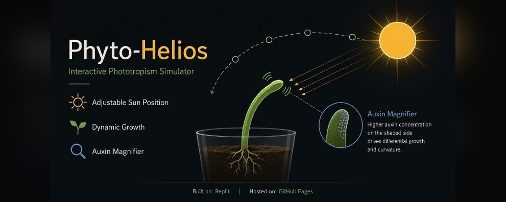

  

# ☀️ Phyto-Helios

### *Interactive Phototropism Simulator*

> **Phyto-Helios** is an interactive visualization exploring **plant phototropism, directional light perception, auxin redistribution, and differential growth**.
>
> ☀️ **Plant Physiology** · 🌱 **Phototropism** · 🧪 **Auxin**

**🔬 [Explore the Simulation](YOUR-LINK-HERE)**

---

## ✦ Features

**☀️ Dynamic Growth**  
Observe shoot bending in response to changing light direction.

**🌞 Interactive Light Position**  
Reposition the light source to investigate phototropic responses.

**🧪 Auxin Visualization**  
Explore auxin redistribution and the **Cholodny–Went mechanism** during differential growth.

**📱 Responsive Design**  
Optimized for modern desktop and mobile devices.

---

## 🧬 Core Concepts

**Phototropism · Auxin Redistribution · Cholodny–Went Model · Differential Growth · Light Perception · Plant Physiology**

---

## ⚙️ Technology

**HTML · CSS · JavaScript**

**Repository:** GitHub & Codeberg  
**Hosting:** GitHub Pages

---

## 📜 License

Distributed under the **GNU General Public License v3.0 (GPL-3.0)**.
